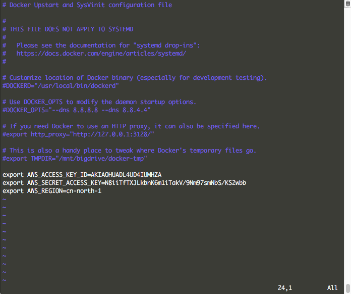

# AWS Log

## 介绍

您可以使用 Amazon CloudWatch Logs 来监控、存储和访问来自各种设施的日志，在 DCE 中你可以通过集成 AWS Log，然后通过 Amazon CloudWatch 或其他方式来检索各个容器的日志。


## 准备

1. 创建一个拥有推送日志的帐号

	在 AWS 创建了帐户后会给您帐号对应的 Access ID 和 Access Token，注意保管好这两个密钥。

	根据最小权限原则，您最好使用一个仅有日志推送权限的帐号用于集成。您可以在用户的权限 Tab 下的内联策略中精细地配置该帐号的权限。

	该配置文件的内容为：

	```json
	{
	  "Version": "2012-10-17",
	  "Statement": [
	    {
	      "Action": [
	        "logs:CreateLogStream",
	        "logs:PutLogEvents"
	      ],
	      "Effect": "Allow",
	      "Resource": "*"
	    }
	  ]
	}
	```

	

2. 配置 Docker Daemon

	如果您使用的是 Ubuntu 14.04 的 Upstart 启动的 Docker，可以直接修改 `/etc/default/docker` 来配置您的 Docker Daemon。

	

	如果您使用的是 SystemD 来启动的 Docker，需要配置您的 `docker.service` Unit 文件，在 CentOS7 上，它一般在如下位置：

	```
	/etc/systemd/system/multi-user.target.wants/docker.service
	/usr/lib/systemd/system/docker.service
	```

	

	** 注意：如果您要在 DCE 集群中使用 AWS Log，那么需要在每台节点的 Docker Daemon 中都进行配置。 **

## 使用

您可以使用 AWS Log 来收集容器的日志。

在启动容器时，可以通过指定 `log-driver` 来指定容器的日志引擎：

```bash
docker run --log-driver=awslogs --log-opt awslogs-region=cn-north-1 --log-opt awslogs-group=dce_dev daocloud.io/nginx
```

您也可以使用 Docker Compose 来管理应用的日志引擎：

```yaml
version: '2'
services:
  nginx:
    image: daocloud.io/nginx
    logging:
      driver: awslogs
      options:
        awslogs-region: cn-north-1
        awslogs-group: dce_dev
```

之后您就可以在 AWS CloudWatch 的日志页面上看见所有容器的日志了。

参考：

* [Docker 集成 AWS Log](https://docs.docker.com/engine/admin/logging/awslogs/)